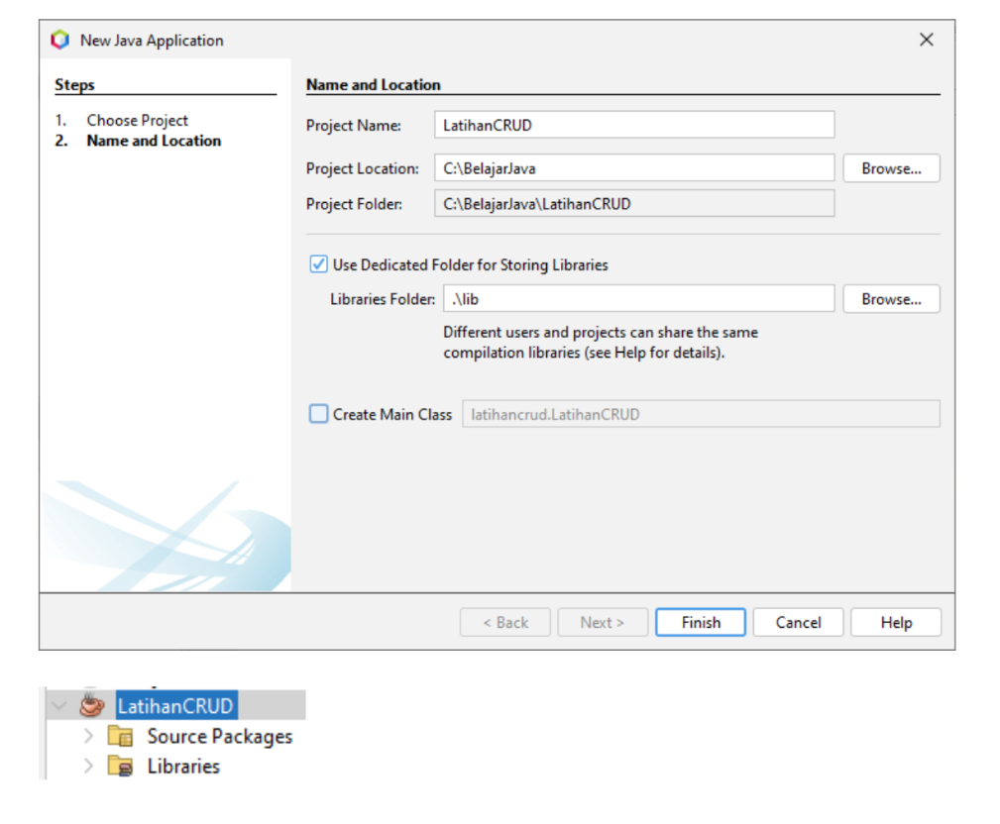
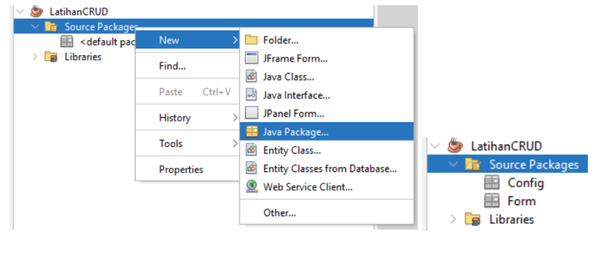
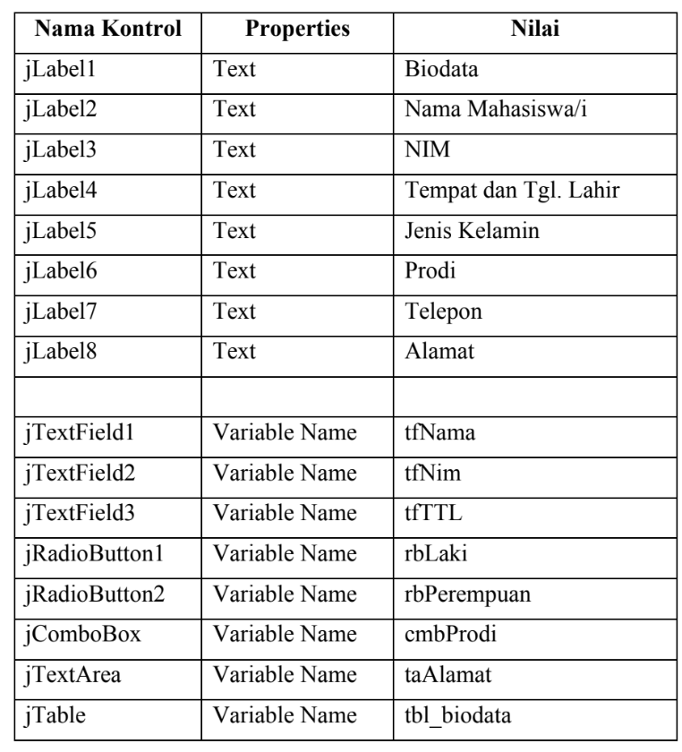
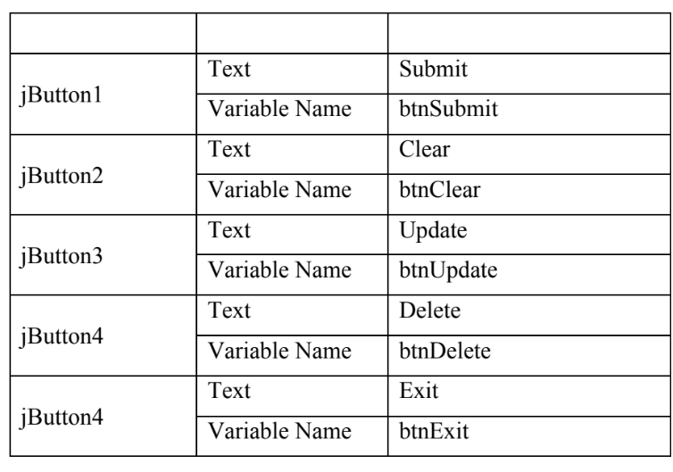
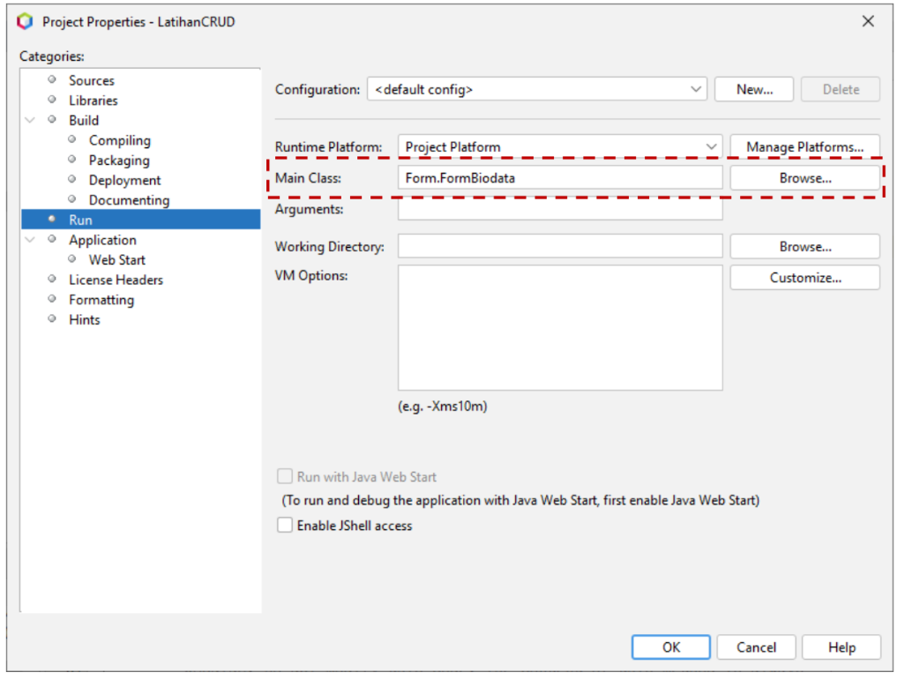

| Nama  | Novianto Andi Hardiansyah  |
| ----- | ---------------------- |
| NIM   | 312210316              |
| Kelas | TI.22.A.3              |
| Tugas | UTS Pemrograman Visual |

### Pada praktikum ini, kita akan membuat Project baru dengan nama LatihanCRUD, dengan memakai Database pv_biodata dan jFrame seperti jFrame Biodata dengan beberapa perubahan desain :


### Buatlah Project baru dengan nama LatihanCRUD.




### Klik kanan Libraries → Add JAR/Folder...


### Buatlah 2 buah Package dengan nama Config dan Form, klik kanan Source Packages → New → Java Package...



### Pada Package Config, bualah Java Class baru dengan nama `KoneksiDB`


### Skrip `KoneksiDB.java`

```java
/*
 * Click nbfs://nbhost/SystemFileSystem/Templates/Licenses/license-default.txt to change this license
 * Click nbfs://nbhost/SystemFileSystem/Templates/Classes/Class.java to edit this template
 */
package config;

import java.sql.Connection;
import java.sql.DriverManager;
import javax.swing.JOptionPane;

/**
 *
 * @author mdinal
 */
public class KoneksiDB {

    private static Connection conn;

    public static Connection getKoneksi() {
        try {
            Class.forName("com.mysql.cj.jdbc.Driver");
            String url = "jdbc:mysql://localhost:3306/pv_biodata";
            String user = "root";
            String password = "";
            conn = DriverManager.getConnection(url, user, password);
            JOptionPane.showMessageDialog(null, "Koneksi Berhasil");
        } catch (Exception e) {
            JOptionPane.showMessageDialog(null, "Koneksi Gagal");
        }
        return conn;
    }
}
```

### Test Koneksi dengan membuat jForm baru dan jangan lupa untuk cek koneksi pada tab Services


```java
private void btnCekKoneksiActionPerformed(java.awt.event.ActionEvent evt) {
// TODO add your handling code here:
Connection conn = new KoneksiDB().getKoneksi();
}
```

### Keterangan :

• JDBC (Java Data Base Connectivity) untuk menghubungkan Java dan MySQL.
• JDBC bertugas menyediakan koneksi ke database, sehingga kita bisa mengakses dan mengelola datanya dari program Java. Ada beberapa istilah yang harus dipahami dalam JDBC:
• DriverManager: adalah sebuah class yang mengelola dirver;
• Driver: adalah interface yang menangani komunikasi dengan database.
• Connection: adalah interface yang menyediakan method untuk menghubungi database;
• Statement: adalah interface untuk mengeksekusi query;
• ResultSet: adalah interface untuk menampung data hasil query.

### Pada Package Form, buatlah jFrame Form dengan nama `FormBiodata.`


### Set Properties :




### Klik kanan Project → Properties → Run



### Set import :

```java
package form;

import config.KoneksiDB;
import javax.swing.JOptionPane;
import java.sql.*;
import javax.swing.table.DefaultTableModel;
```

### Menyiapkan objek yang diperlukan untuk mengelola database

```java
public class FormBiodata extends javax.swing.JFrame {

    private Statement st;
    private ResultSet rs;
    private Connection conn;
```

### Set pemanggilan method:

```java
public FormBiodata() {
        initComponents();
        conn = KoneksiDB.getKoneksi();
        tampilData();
    }
```

### Membuat method tampilData()

```java
private void tampilData() {
DefaultTableModel kolomtabel = new DefaultTableModel();
kolomtabel.addColumn("No.");
kolomtabel.addColumn("Nama")
kolomtabel.addColumn("NIM");
kolomtabel.addColumn("TTL");
kolomtabel.addColumn("Jenis Kelamin");
kolomtabel.addColumn("Prodi");
kolomtabel.addColumn("No. Telepon");
kolomtabel.addColumn("Alamat");
try {
    int nomor = 1;
    // buat objek statement untuk mengeksekusi query mysql.
    st = conn.createStatement();
    // buat query ke database
    String sql = "Select * FROM tbl_biodata";
    // eksekusi query dan simpan hasilnya di objek ResultSet
    rs = st.executeQuery(sql);
    // tampilkan hasil query menggunakan perulangan while
    while (rs.next()) {
        kolomtabel.addRow(new Object[]{
            ("" + nomor++),
            rs.getString("nama"),
            rs.getString("nim"),
            rs.getString("ttl"),
            rs.getString("jekel"),
            rs.getString("prodi"),
            rs.getString("notelp"),
            rs.getString("alamat"),});
            tabel_biodata.setModel(kolomtabel);
            tabel_biodata.enable(true);
            tfNama.requestFocus();
            }
            } catch (Exception e) {
                JOptionPane.showMessageDialog(null, "Gagal menampilkan data.
                \n" + e.getMessage());
                }
        }
```

### Keterangan :

• Method executeQuery() akan menghasilkan nilai kembalian berupa objek ResultSet.
• Method ini biasanya digunakan untuk mengambil data dari database.

### Membuat method clearForm()

```java
// membuat method clear form
private void clearForm() {
tfNama.setText("");
tfNIM.setText("");
tfTTL.setText("");
buttonGroup1.clearSelection();
cmbProdi.setSelectedItem("-- Program Studi --");
tfNomorTelepon.setText("");
taAlamat.setText("");
tfNama.requestFocus();
}
```

### Skrip Button Submit :


```java
private void btnSubmitActionPerformed(java.awt.event.ActionEvent evt) {
    // TODO add your handling code here:
//membuat validasi form kosong
if (tfNama.getText().equals("")
|| tfNIM.getText().equals("")
|| tfTTL.getText().equals("")
|| tfNomorTelepon.getText().equals("")
|| taAlamat.getText().equals("")
|| buttonGroup1.isSelected(null)
|| cmbProdi.getSelectedItem().equals("-- Program Studi --")) {
    JOptionPane.showMessageDialog(this, "Field harap di isi !",
    "Validasi", JOptionPane.ERROR_MESSAGE);
    return;
    }
    try {
        String cekDB = "SELECT * FROM tbl_biodata WHERE nim = '" +
        tfNIM.getText() + "' ";
        rs = st.executeQuery(cekDB);
        if (rs.next()) {
            JOptionPane.showMessageDialog(null, "NIM sudah tersedia !");
            } else {
                st = conn.createStatement();
                String jekel;
                if (rbLaki.isSelected()) {
                    jekel = "Laki - Laki";
                    } else {
                        jekel = "Perempuan";
                        }
                        //aksi simpan data (Submit/Save/Add)
                        String sql = "INSERT INTO tbl_biodata1 VALUES ('"
                        + tfNama.getText()
                        + "', '" + tfNIM.getText()
                        + "', '" + tfTTL.getText()
                        + "', '" + jekel
                        + "', '" + cmbProdi.getSelectedItem()
                        + "', '" + tfNomorTelepon.getText()
                        + "', '" + taAlamat.getText()
                        + "') ";
                        st.executeUpdate(sql);
                        JOptionPane.showMessageDialog(null, "Data berhasil di simpan");
                        tampilData();
                        clearForm();
                        }
                        } catch (Exception e) {
                            JOptionPane.showMessageDialog(this, e.getMessage());
                            }
                        }
```

Keterangan :
• JDBC (Java Data Base Connectivity) untuk menghubungkan Java dan MySQL.
• JDBC bertugas menyediakan koneksi ke database, sehingga kita bisa mengakses dan mengelola datanya dari program Java. Ada beberapa istilah yang harus dipahami dalam JDBC:
• DriverManager: adalah sebuah class yang mengelola dirver;
• Driver: adalah interface yang menangani komunikasi dengan database.
• Connection: adalah interface yang menyediakan method untuk menghubungi database;
• Statement: adalah interface untuk mengeksekusi query;
• ResultSet: adalah interface untuk menampung data hasil query.

### Klik ganda pada button Delete, dan mmasukkan skrip berikut :

```java
private void btnDeleteActionPerformed(java.awt.event.ActionEvent evt) {
// TODO add your handling code here:
hapusData();
}
```

### kemudian kita akan membuat method hapusData

```java
private void hapusData() {
    int row = tabel_biodata.getSelectedRow();
    if (row == -1) {
        JOptionPane.showMessageDialog(this, "Pilih baris yang akan di hapus !");
        return;
    }
    int jawab = JOptionPane.showOptionDialog(this,
    "Apakah Anda ingin menghapus data ini?",
    "Konfirmasi",
    JOptionPane.YES_NO_OPTION,
    JOptionPane.QUESTION_MESSAGE, null, null, null);
    if (jawab == JOptionPane.YES_OPTION) {
        try {
            String sql = "DELETE FROM tbl_biodata WHERE nim='" +
            tfNIM.getText() + "' ";
            pst = conn.prepareStatement(sql);
            pst.executeUpdate();
            JOptionPane.showMessageDialog(null, "Data berhasil di hapus");
            clearForm();
            tampilData();
            } catch (Exception e) {
                JOptionPane.showMessageDialog(this, e.getMessage());
                }
                } else {
                    clearForm();
                    tampilData();
                    }
                }
```

### Klik kanan pada desain table → Events → Mouse → mouseClicked


### Masukan skrip berikut :

```java
private void tabel_biodataMouseClicked(java.awt.event.MouseEvent evt) {
    // TODO add your handling code here:
    int row = tabel_biodata.getSelectedRow();
    if (tabel_biodata.getValueAt(row, 4).equals("Laki-laki")) {
        rbLaki.setSelected(true);
        } else if (tabel_biodata.getValueAt(row, 4).equals("Perempuan")) {
            rbPerempuan.setSelected(true);
            }
            tfNama.setText(tabel_biodata.getValueAt(row, 1).toString());
            tfNIM.setText(tabel_biodata.getValueAt(row, 2).toString());
            tfTTL.setText(tabel_biodata.getValueAt(row, 3).toString());
            cmbProdi.setSelectedItem(tabel_biodata.getValueAt(row, 5).toString());
            tfNomorTelepon.setText(tabel_biodata.getValueAt(row, 6).toString());
            taAlamat.setText(tabel_biodata.getValueAt(row, 7).toString());
            }
```

### Jalankan aplikasinya


# Laporan

[](https://drive.google.com/file/d/1C0p69kHm73m86n1Lypr3LbxawxNNlrRs/view?usp=sharing)
